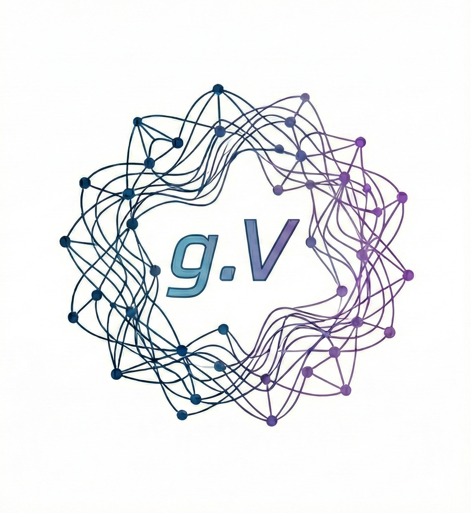
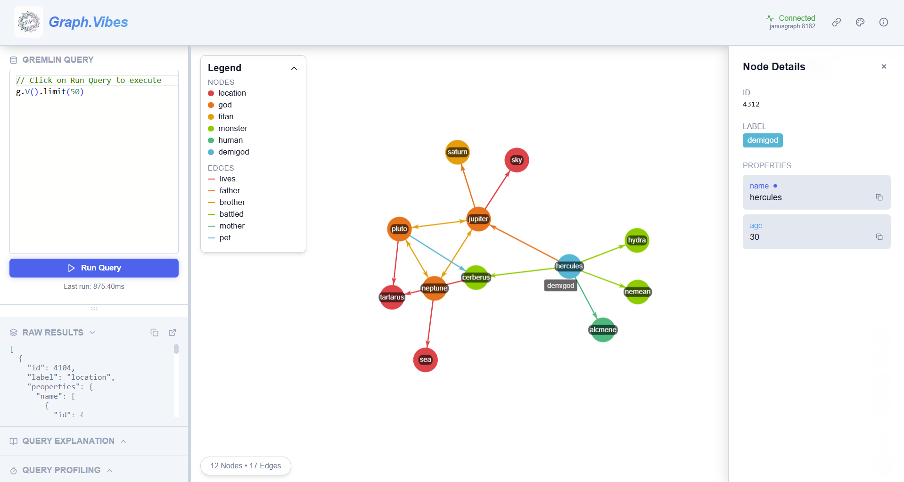

#  Graph.Vibes - Gremlin Graph Visualizer

**Graph.Vibes** is a modern interactive web-based visualizer for Gremlin-compatible graph databases. It provides a powerful interface for writing Gremlin queries, visualizing the results as a force-directed graph, and exploring your data with advanced interactive features.

**Motivation and Development Experience** --
Graph.Vibes was built entirely with [Antigravity](https://antigravity.dev) and [Gemini 3 Pro](https://gemini.ai/). This project was motivated by a personal interest in learning how to "vibe code" a fairly complex web application using modern development workflows that rely on AI coding agents. While the development process required sustantial time spent testing and debugging the application and providing feedback to the AI agent to get it to write code that was free of errors, no manual code changes were made to the codebase. Only some minor manual documentation changes were added to the [README.md](README.md) file.

<div align="center">
  
</div>

### Main Development Tools
-   [Antigravity](https://antigravity.dev)
-   [Gemini 3 Pro](https://gemini.ai/)
-   [Next.js](https://nextjs.org/)
-   [react-force-graph](https://github.com/vasturiano/react-force-graph)
-   [Gremlin](https://github.com/tinkerpop/gremlin)

## 🚀 Features

-   **Interactive Visualization**: 2D force-directed graph with zoom, pan, and drag capabilities.
-   **Gremlin Console**: Write and execute raw Gremlin scripts directly from the UI.
-   **Smart Expansion**: Double-click any node to fetch and reveal its hidden neighbors (with configurable limit).
-   **Flexible Labeling**: Click any property in the details panel to instantly use it as the label for all nodes of that type.
-   **Theming**: Includes Light (Default), Dark, and Midnight themes with a glassmorphism aesthetic.
-   **Deep Customization**:
    -   Separate Node and Edge color palettes.
    -   Adjustable styling (Standard, Glass, Paper, Inverted).
    -   Toggleable Legend.
-   **Data Inspection**: Detailed side panel for inspecting node and edge properties.

## 🛠️ Prerequisites

-   **Node.js**: v14.x or higher (v18+ recommended).
-   **Gremlin Server**: A running instance of a Gremlin Server (e.g., JanusGraph, TinkerPop) (default: `localhost:8182`).

## ✅ Compatibility & Requirements

### Environment
-   **Node.js**: v18.x, v20.x (Tested on v20.19.6)
-   **Yarn/NPM**: Latest versions.

### Dependencies
Using latest versions of core libraries:
-   `react-force-graph-2d`: Latest (Unpinned)
-   `gremlin`: `3.5.6`
-   `lucide-react`: Latest (Unpinned)

*Feature Active*: Syntax checking (Monaco Editor) is enabled.

## 📦 Installation

1.  Clone the repository:
    ```bash
    git clone https://github.com/perdisci/GraphVibes.git
    cd GraphVibes
    ```

## 🐳 Running with Docker

1.  **Create the network** (Required for container communication):
    ```bash
    docker network create jgnet
    ```

2.  **Start Graph.Vibes**:
    ```bash
    docker-compose up -d
    ```
    The application will be available at `http://localhost:3000`.

## 🐉 Quick Start with JanusGraph

To test Graph.Vibes, you can run a local generic JanusGraph instance and load the "Graph of the Gods" example dataset.

1.  **Start JanusGraph (In-Memory)**:
    Run the following command to start a JanusGraph container on the `jgnet` network:
    ```bash
    docker run --rm -d --name janusgraph --network jgnet -p 8182:8182 janusgraph/janusgraph:1.1.0
    ```

2.  **Load "Graph of the Gods"**:
    Access the container to load the example graph using the Gremlin Console:
    ```bash
    docker exec -it janusgraph ./bin/gremlin.sh
    ```
    Inside the console, run:
    ```groovy
    :remote connect tinkerpop.server conf/remote.yaml
    :remote console
    GraphOfTheGodsFactory.load(graph)
    ```
    Type `:exit` to leave the console when done.

3.  **Connect Graph.Vibes**:
    -   Open Graph.Vibes at `http://localhost:3000`.
    -   Click the **Connection** icon.
    -   **Host**: `janusgraph` (Since both the Graph.Vibes and JanusGraph containers are on the `jgnet` Docker network).
    -   **Port**: `8182`.
    -   Click **Test Connection** -> **Save & Connect**.

4. **Run a Query**:
    -   Enter a Gremlin query in the dedicated console at the bottom (e.g., `g.V().limit(50)`).
    -   Click **Run Query** (or Press `Ctrl/Cmd + Enter`).
    -   Explore the graph!


## 🏃‍♂️ Manual Usage

1.  Install dependencies:
    ```bash
    npm install
    # or
    yarn install
    ```

2.  **Start the development server**:
    ```bash
    npm run dev
    ```

3.  **Open the application**:
    Navigate to `http://localhost:3000` in your browser.

4.  **Connect to Server**:
    -   Click the **Connection** icon (WiFi symbol) in the header.
    -   Enter your Gremlin server details (Default: `localhost` : `8182`).
    -   Click **Test Connection** to verify.

5.  **Visualize Data**:
    -   Enter a Gremlin query in the dedicated console at the bottom (e.g., `g.V().limit(10)`).
    -   Click **Run Query** (or Press `Ctrl/Cmd + Enter`).
    -   Explore the graph!

## 🎮 Interaction Guide

-   **Search Nodes**: Use the **Search Box** (top-right) to find nodes by ID or label. Press `Enter` to auto-center and zoom on the result.
-   **Select Node/Edge**: Single-click an element to view its details in the right-hand panel. Use the **Copy Icon** next to properties to copy values.
-   **Expand Neighborhood**: **Double-click** a node to fetch and display its connected neighbors.
    -   *Config*: You can adjust the "Expansion Limit" in the Settings.
-   **Set Displayed Node Labels**:
    1.  Click a node to open details.
    2.  **Click on any property name** (e.g., `name`, `age`, `city`) in the list.
    3.  All nodes of that type will update to use that property as their label.
    4.  Click again to revert to showing the Node ID.
-   **Pan/Zoom**: Click and drag background to pan; Scroll to zoom.
-   **Fit View**: Click the **Locate** icon (Target symbol) to center the graph.
-   **Query Profiling**: Toggle the **Query Profiling** panel (bottom-left) to view execution strategies and performance stats for your Gremlin queries.

## ⚙️ Configuration

Global settings can be accessed via the **Settings** icon (Tools symbol) in the header:
-   **Background Color**: Override theme defaults.
-   **Theme**: Switch between Light, Dark, and Midnight.
-   **Graph Layout**: Choose how nodes are arranged:
    -   *Force Directed*: Standard physics simulation (Default).
    -   *Circular*: Arranges all nodes in a minimal overlap circle.
    -   *Community*: Clusters nodes by **Label** in a radial grouping pattern.
    -   *Tree / Radial*: Hierarchical layouts (DAG Mode) for directed graphs.
-   **Palettes**: Choose distinct color schemes for Nodes and Edges.
-   **Expansion Limit**: Set the max number of neighbors to fetch on node double-click.

## 🤝 Contributing

Contributions are welcome! Please feel free to submit a Pull Request.

## 📄 License

This project is open-source and available under the [MIT License](LICENSE).
